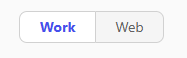

---
task:
    title: 'WWL AI Frontier Workshop – Define the Challenge'
---

## WWL AI Frontier Workshop – Define the Challenge

**Suggested time:** 10 minutes

As a team, identify and agree on one common challenge to focus on for the rest of the workshop. This could be something simple, like scheduling meetings, or something more complex, like an outdated process. The goal is to spark conversation about what’s working, what’s not, and where AI might play a role.

You'll complete the following:

- Discuss current challenges or opportunities in your work environment  
- Select one challenge to focus on and draft a clear problem statement  

> **Note:** The provided sample prompts are just a starting point. Work with your team to adapt or create your own, and refine until Copilot delivers the results you need.

### Explore Challenges or Opportunities

spend about 5 minutes sharing the day-to-day challenges you experience at work.  

Consider these guiding questions:  

- **What’s working well today**  
- **What’s not working well**  
- **Where AI *might* be able to help**  

To help generate ideas, you may also prompt Copilot individually and bring your findings back to the group.  

**Steps**:  

- Open a new browser tab and navigate to <a href="https://m365.cloud.microsoft/chat" target="_blank">m365.cloud.microsoft/chat</a>.  
- Ensure the **Work mode** tab is selected in Copilot Chat:  

      

    **Sample Prompt**:  

    ```text
    I’m researching common day-to-day issues I face at work, such as processes, collaboration, or time management. Look at recent conversations from [Teams chats, Outlook emails, or other collaboration tools] related to [your role focus, i.e., content development, technical training, program management]. Summarize the key issues or pain points mentioned in the last 6 months. Show the results in a table with:  
    
    - Title: Short label for the issue  
    - Description: Brief summary of the challenge  
    - Frequency: How often it comes up (e.g., number of mentions) 
    ```

    > **Note:** Replace the text within brackets with your specific choice (e.g., replace [your role focus] with program management).

### Create a Problem or Opportunity Statement  

Choose **one challenge or opportunity** from the previous discussion to carry forward. The goal is to capture it clearly and simply so you can explore solutions later.  

A helpful way to frame it is:  
> “We [struggle with / see an opportunity to] **[X]** because **[Y]**, which impacts or could improve **[Z]**.”  

Example: *“We struggle with spending too much time searching for the right information because it’s spread across different tools, which impacts our ability to focus on higher-value work.”*  

> **Note:** You can also use Copilot Chat to help compare your list of challenges/opportunities from the previous step and suggest which one might have the biggest impact.  

## Your Output  

**Section:** Problem Statement  

In the provided Workshop Template, fill in the **Problem Statement** section. Summarize the single challenge or opportunity your team agreed on, written as a clear and concise statement.

---

#### Next Step: Break Down the Problem

<a href="https://microsoftlearning.github.io/AI-Frontier-Workshop/Instructions/Labs/1-kickoff-and-team-formation" 
   style="display:inline-block; padding:10px 18px; border:1px solid #0078D4; border-radius:6px; 
          background-color:#ffffff; color:#0078D4; font-weight:bold; text-decoration:none;">
   &#x25C0; Previous
</a>
<a href="https://microsoftlearning.github.io/AI-Frontier-Workshop/Instructions/Labs/3-break-down-the-problem.html" 
   style="display:inline-block; padding:10px 18px; border:1px solid #0078D4; border-radius:6px; 
          background-color:#0078D4; color:#ffffff; font-weight:bold; text-decoration:none; margin-left:10px;">
   Next &#x25B6;
</a>
