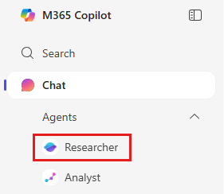

---
task:
    title: 'WWL AI Frontier Workshop – Explore AI Solutions'
---

## WWL AI Frontier Workshop – Explore AI Solutions  

**Suggested time:** 20 minutes  

From the list of sub-issues and pain points you identified in the last step, choose one to focus on. The goal is to brainstorm broadly, consider different types of Microsoft solutions, and then select one or two promising options to carry forward.

You'll complete the following:

- Use **Researcher** to gather solution ideas  
- Brainstorm and capture AI solution options  
- Discuss how each option could work in practice  
- Select the most promising solution(s)  

### Use Researcher to Gather Ideas  

Kick off by running a query in **Researcher**. Since results may take a few minutes, let it process while you move on to the group discussion.  

**Steps:**  

1. Open a new browser tab and navigate to [m365.cloud.microsoft/chat](https://m365.cloud.microsoft/chat/)  
2. In the M365 Copilot menu, expand **Agents** and select **Researcher**  

      

    **Sample Prompt:**  

    ```text
    Explore possible AI-powered solutions to address [Insert Selected Sub-Issue Here]. Focus on three categories: Prebuilt Copilot features (M365 Copilot, Copilot Agents), Declarative solutions (SharePoint Agents, Agent Builder, M365 Agents Toolkit, Copilot Studio), and Custom solutions (Copilot Studio, Azure AI Foundry, Semantic Kernel). Summarize options and how they could help automate, improve, or streamline the workflow.
    ```  

### Brainstorm AI Solutions

As a team, build on the Researcher output and your own ideas. Consider:

- Which Prebuilt, Declarative, or Custom solutions might apply?
- Could automation or agentic workflows help streamline the process?
- Are there simpler process changes that should be considered alongside AI?

### Discuss & Select

For each option, briefly consider:

- How would it fit into your workflow?
- Who benefits most from this solution?
- What risks or limitations exist?

Agree on one solution to carry forward, and capture your reasoning in the worksheet.

## Workshop Output  

**Section:** Approach Options  

In your team Word document or worksheet, create a new section titled “Approach Options.” Summarize the solutions your team discussed, including the one you’ve selected to carry forward. This output will be used later on.
