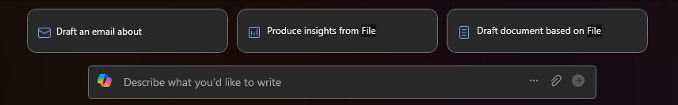

---
task:
    title: 'WWL AI Frontier Workshop – Capture & Share'
---

## WWL AI Frontier Workshop – Capture & Share  

**Suggested time:** 10 minutes  

In this final step, your team will bring everything together into a polished pitch. You’ll give your solution a name, generate a short summary with Copilot in Word, and complete the submission template.  

You'll complete the following:  

- Come up with a name for your solution  
- Compile your outputs into Word and use Copilot to generate a pitch  
- *(Optional)* Create a logo or image for your solution  
- Submit your idea for judging  

### Name Your Solution  

Give your chosen solution a simple, memorable name. This will help make your pitch clearer and easier to share.  

### Compile & Generate Your Pitch  

Pick one teammate to type in **Copilot in Word**, but build the pitch together as a group — everyone should help guide what goes in.  

**Steps:**  

- Create a new Word document at [word.new](https://word.new)  
- Title the document: **[Solution Name] Pitch**  
  > **Note:** Replace [Solution Name] with the name your team chose  

- Enter your prompt where it says *“Describe what you’d like to write”*  

    

    **Sample Prompt:**  

    ```text
    Create a short pitch for our AI Solution idea based on these sections:  
    - Solution Name: [paste here]  
    - Problem Statement: [paste here]  
    - Pain Points & Inefficiencies: [paste here]  
    - Approach Options: [paste here]  
    - Chosen Solution & Why: [paste here]  
    ```

    > **Note:** Replace the text within brackets with your copied content from your shared workspace or team document.  

### *(Optional)* Create an Image  

If time allows, use **Creator** to design a simple image or logo for your solution.  

**Steps:**  

- Navigate to [https://m365.cloud.microsoft/create](https://m365.cloud.microsoft/create)  
- Select **Create an image**  
- Enter your prompt where it says *“Describe your image”*  

    **Sample Prompt:**  

    ```text
    Create a simple and modern logo for a solution named [Solution Name] that targets [target audience/industry]. The logo should convey [desired qualities, e.g., innovation, reliability].  
    ```

    > **Note:** Replace the text within brackets with your team’s choices (e.g., solution name, target audience, desired qualities).  

- Choose a style, brand color, and size  
- Select **Create**  

### Submit Your Idea  

Once your pitch and template are complete, submit your team’s idea for judging. Your Table Coach can confirm how submissions will be collected.  

- Navigate to the [Idea Submission Form](https://microsoftapc.sharepoint.com/teams/SyncWeekHack/_layouts/15/listforms.aspx?cid=NmEzYTBhM2MtODNhMi00M2IwLTk5ZGQtZmYzMGZiMTQyYTdi&nav=YjJlZjI3MWItODgxNy00NmE1LTliNzItOWJmMjJkOTY2NTZh)  
- You will need to collect the following information:  
  - Team Name  
  - Table Number  
  - Summary  
  - Problem or Opportunity Statement  
  - Presentation (Word) → upload your pitch document  
  - Tagline (optional)  
  - Participant Aliases  
  - Image (optional)  
